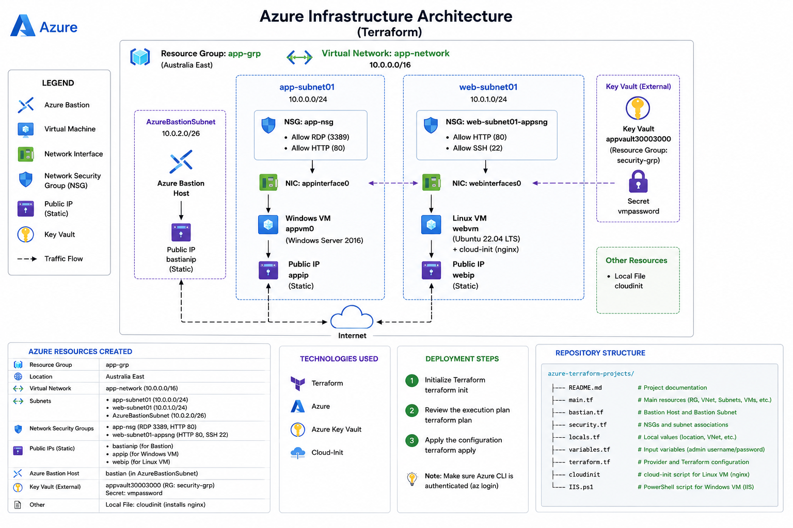

# Azure Terraform Projects

## Overview

This repository contains my Microsoft Azure Infrastructure as Code (IaC) projects built using Terraform. The project provisions a secure Azure environment consisting of Windows and Linux virtual machines, Azure networking components, Azure Bastion for secure remote access, Azure Key Vault integration for secret management, and automated Linux server configuration using Cloud-Init.

---

## Architecture Diagram

The following diagram illustrates the Azure infrastructure deployed using Terraform.

<p align="center">
  
</p>

---

## Technologies Used

- Microsoft Azure
- Terraform
- Git & GitHub
- Azure Key Vault
- Azure Bastion
- Cloud-Init
- Ubuntu Linux
- Windows Server 2016

---

## Azure Resources Deployed

- Azure Resource Group
- Virtual Network (10.0.0.0/16)
- Application Subnet (10.0.0.0/24)
- Web Subnet (10.0.1.0/24)
- AzureBastionSubnet (10.0.2.0/26)
- Network Security Groups (NSGs)
- Public IP Addresses
- Network Interfaces (NICs)
- Windows Virtual Machine
- Ubuntu Linux Virtual Machine
- Azure Bastion Host
- Azure Key Vault
- Key Vault Secret

---

## Features

- Deploys Azure infrastructure using Terraform
- Creates separate application and web network segments
- Deploys both Windows Server and Ubuntu virtual machines
- Configures Azure Bastion for secure browser-based remote access
- Retrieves VM administrator credentials securely from Azure Key Vault
- Installs and configures Nginx automatically using Cloud-Init
- Applies Network Security Groups with custom inbound rules
- Uses reusable Terraform variables, locals, and data sources

---

## Skills Demonstrated

- Infrastructure as Code (Terraform)
- Azure Virtual Networking
- Windows & Linux Virtual Machines
- Azure Bastion
- Azure Key Vault
- Cloud-Init Automation
- Network Security Groups (NSGs)
- Public IP & Network Interface Configuration
- Terraform Variables, Locals & Data Sources
- Terraform State Management
- Azure RBAC
- Git Version Control

---

## Project Structure

```text
.
├── README.md
├── main.tf
├── bastian.tf
├── security.tf
├── terraform.tf
├── variables.tf
├── locals.tf
├── cloudinit
├── IIS.ps1
└── images/
    └── architecture-diagram.png
```

---

## Deployment

```bash
terraform init
terraform validate
terraform fmt
terraform plan
terraform apply
```

---

## Future Improvements

- Implement reusable Terraform modules
- Deploy Azure Load Balancer
- Deploy Virtual Machine Scale Sets (VMSS)
- Configure Azure Monitor and Log Analytics
- Store Terraform state remotely in Azure Storage
- Integrate CI/CD using GitHub Actions